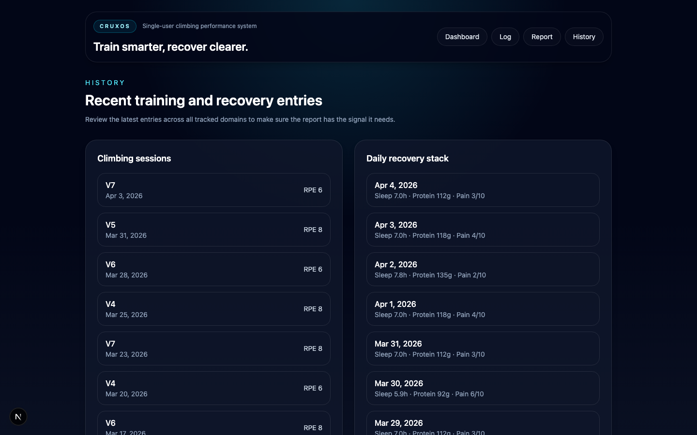
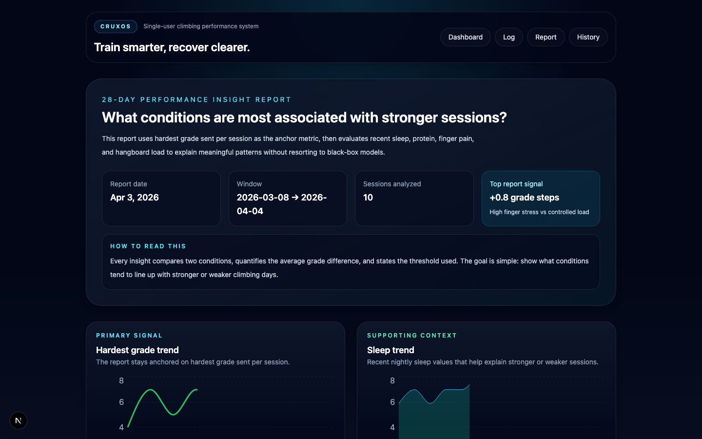

# CruxOS

CruxOS is a full-stack climbing performance tracker that turns training and recovery logs into **explainable, comparison-based insights**.

It is designed to answer one question clearly:

> **What conditions tend to lead to better or worse climbing sessions?**

## What It Is

CruxOS is a single-user web app for tracking:
- climbing sessions
- sleep
- nutrition
- bodyweight
- hangboard sessions
- finger rehab / pain

The core experience is the **28-day Performance Insight Report**, which compares conditions like higher sleep vs lower sleep or high finger stress vs controlled load, then quantifies how those conditions are associated with climbing performance.

## Why It’s Technically Interesting

This project is more than a logging app. It demonstrates:

- **Multi-domain data modeling** across training, recovery, and performance
- **Time-window analysis** over rolling 28-day periods
- **Explainable analytics** with deterministic condition-vs-condition comparisons
- **Full-stack ownership** across UI, data layer, report generation, seeding, and tests
- **Product judgment** through a focused MVP with one clear centerpiece feature

In interview terms, CruxOS shows the ability to take an ambiguous real-world problem, define a useful product, and deliver a system that produces understandable outputs instead of black-box results.

## Main Features

- **Dashboard** with recent sessions, top insights, and key recovery metrics
- **Logging hub** for climbing, sleep, nutrition, bodyweight, hangboard, and rehab
- **History view** for recent training and recovery entries
- **28-day Performance Insight Report** with:
  - clear condition comparisons
  - quantified average-grade differences
  - thresholds
  - concise human-readable explanations
- **Seeded demo data** so the app is immediately meaningful on first load
- **End-to-end tested core flows** for logging and report generation

## Architecture Summary

### Stack
- **Frontend:** Next.js (App Router), React, TypeScript
- **Backend:** Next.js server actions / server-rendered routes
- **Database:** Prisma + SQLite
- **Charts:** Recharts
- **Validation:** Zod
- **Testing:** Vitest + Playwright

### Design Choices
- **One anchor metric:** hardest grade sent per session
- **Deterministic analytics:** no ML, no opaque scoring
- **Manual-first MVP:** no external integrations or social features
- **Relational time-series model:** inputs align by date/session for report generation

### Key Routes
- `/` — dashboard
- `/log` — logging hub
- `/history` — recent entries
- `/reports/performance` — 28-day report

## Run Locally

```bash
npm install
npm run db:push
npm run db:seed
npm run dev
```

Open:

```text
http://localhost:3000
```


## Deployment

### Recommended Path

The simplest production-ready deployment for CruxOS is:

- **one container**
- **one persistent volume**
- **SQLite via Prisma**

This keeps the app aligned with its current scope: single-user, low-ops, and easy to explain.

### Required Environment Variables

- `DATABASE_URL` — required
- `PORT` — optional, defaults to `3000`

Recommended production value:

```text
DATABASE_URL=file:/data/cruxos.db
PORT=3000
```

### Easiest Deploy Command Set

Build the image:

```bash
docker build -t cruxos .
```

Create a persistent Docker volume:

```bash
docker volume create cruxos_data
```

Run CruxOS:

```bash
docker run -d   --name cruxos   -p 3000:3000   -e DATABASE_URL="file:/data/cruxos.db"   -e PORT=3000   -v cruxos_data:/data   cruxos
```

### What the Container Does on Startup

The production start script will:
1. run `prisma db push`
2. start Next.js in production mode

That means no manual migration step is required for this MVP deployment path.

### Optional Demo Data for a First Deploy

If you want the hosted app to open with meaningful sample data, run this once after the container starts:

```bash
docker exec cruxos npm run db:seed
```

> Note: the seed script resets demo data intentionally. Use it for portfolio/demo environments, not for preserving personal production logs.

### Good Hosting Targets

This container-first setup works best on platforms where you can mount persistent storage, for example:
- a small VPS
- Fly.io with a mounted volume
- Render or Railway only if you attach persistent disk/storage

### Repo Files Added for Deployment

- `Dockerfile`
- `.dockerignore`
- `.env.example`
- `scripts/start-production.sh`

## Verification

```bash
npm run lint
npm test
npx tsc --noEmit --pretty false --project ./tsconfig.json
npm run build
npm run test:e2e
```

## Screenshots

### Dashboard


### Logging Hub


### History View



### Performance Insight Report



## Problem It Solves

Climbers often track recovery and training data in separate tools, which makes it difficult to understand how habits actually relate to performance.

CruxOS solves that by combining the inputs into one system and generating a report that is:
- **interpretable**
- **quantified**
- **easy to explain**

## Current Scope

### Included
- manual logging
- dashboard
- history view
- insight report
- seeded demo data
- unit and end-to-end coverage for core flows

### Out of Scope
- machine learning / prediction
- wearable integrations
- multi-user / social features
- native mobile apps
- complex infrastructure

## Future Improvements

- richer report evidence panels
- real screenshot assets for portfolio presentation
- authentication
- export / sharing
- additional deterministic insight rules

---

If you are reviewing CruxOS quickly, start with the **dashboard**, then open the **28-day Performance Insight Report**.
