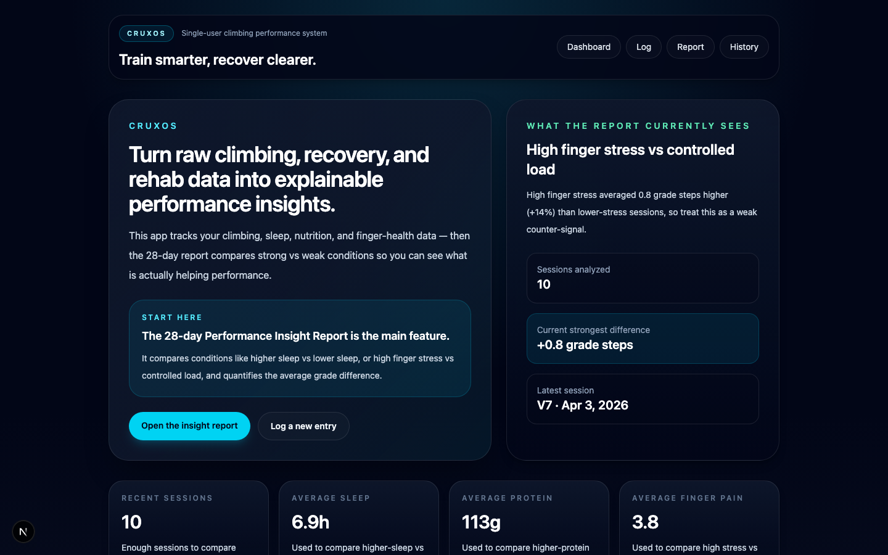
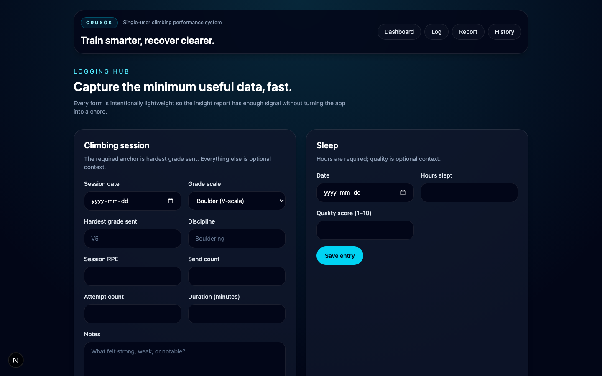

# CruxOS

A recruiter-friendly full-stack project that turns personal training and recovery data into **explainable climbing insights**.

## Overview

CruxOS is a single-user web app for logging:
- climbing sessions
- sleep
- nutrition
- bodyweight
- hangboard sessions
- finger rehab / pain

The app’s core value is a **28-day Performance Insight Report** that compares conditions such as higher sleep vs lower sleep or high finger stress vs controlled load, then explains how those conditions are associated with climbing performance.

The product is intentionally scoped as a realistic MVP: focused, polished, and technically credible without unnecessary complexity.

## Problem It Solves

Climbers often track recovery, training load, and performance across scattered notes, spreadsheets, or separate apps. That makes it hard to answer a simple question:

> **What conditions tend to lead to better or worse climbing sessions?**

This project solves that by combining recovery and training inputs into a single system and generating **deterministic, human-readable insights** anchored on one performance signal:

**Hardest grade sent per session**.

## Key Features

- **Single-user climbing performance dashboard**
- **Fast manual logging** for climbing, sleep, nutrition, bodyweight, hangboard, and rehab
- **28-day Performance Insight Report** with:
  - condition-vs-condition comparisons
  - quantified average-grade differences
  - clear thresholds
  - concise explanations
- **Seeded demo data** so the app is meaningful immediately on first load
- **Responsive UI** optimized for a clean browser-based experience
- **Deterministic analytics** — no ML, no black-box scoring

## Architecture Summary

### Stack
- **Frontend:** Next.js (App Router), React, TypeScript
- **Backend:** Next.js server actions / server-rendered routes
- **Database:** Prisma + SQLite
- **Charts:** Recharts
- **Validation:** Zod
- **Testing:** Vitest + Playwright

### Core Design Choices
- **One anchor metric:** hardest grade sent per session
- **Explainability over complexity:** rule-based insight engine instead of ML
- **Manual-first MVP:** no external integrations, social features, or native apps
- **Relational time-series modeling:** inputs are keyed by date/session so recovery and performance can be aligned over rolling windows

### Main App Areas
- `/` — dashboard and top insights
- `/log` — logging hub for all tracked domains
- `/history` — recent training/recovery history
- `/reports/performance` — 28-day insight report

## Screenshots

> Add real screenshots here after final UI polish.

- `docs/screenshots/dashboard.png` — Dashboard overview
- `docs/screenshots/logging-hub.png` — Logging hub
- `docs/screenshots/performance-report.png` — 28-day insight report

Placeholder example:

```md



```

## How to Run Locally

### 1. Install dependencies

```bash
npm install
```

### 2. Sync the database schema

```bash
npm run db:push
```

### 3. Seed demo data

```bash
npm run db:seed
```

### 4. Start the app

```bash
npm run dev
```

Open:

```text
http://localhost:3000
```

## Verification Commands

```bash
npm run lint
npm test
npx tsc --noEmit --pretty false --project ./tsconfig.json
npm run build
npm run test:e2e
```

## Why This Project Is Technically Interesting

This project is interesting because it demonstrates more than CRUD:

- **Domain modeling:** multiple related data types across training, recovery, and performance
- **Time-window analysis:** rolling 28-day comparisons between behaviors and outcomes
- **Explainable analytics:** each insight compares two conditions and quantifies the difference
- **Full-stack ownership:** UI, server actions, database modeling, seeded demo flows, and automated tests
- **Strong product judgment:** narrow scope, clear user value, and a polished centerpiece feature

It is designed to show that the builder can:
- structure an ambiguous real-world problem
- choose a focused MVP
- build an end-to-end data product
- communicate results in a way users can actually understand

## Current Scope

### Included
- manual logging
- dashboard
- history view
- insight report
- demo data
- unit + end-to-end coverage for core flows

### Explicitly Out of Scope
- machine learning / prediction
- wearable or health-platform integrations
- multi-user / social features
- native mobile apps
- complex infrastructure

## Future Improvements

- richer report evidence panels
- screenshot assets for portfolio presentation
- authentication
- export / sharing
- additional deterministic insight rules

---

If you’re reviewing this as a portfolio project, the best place to start is the **dashboard**, then the **28-day Performance Insight Report**.
